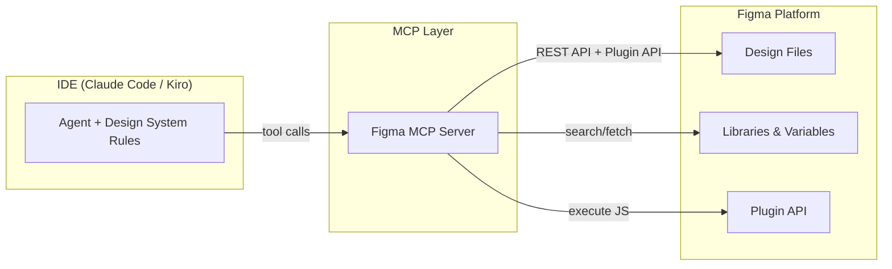
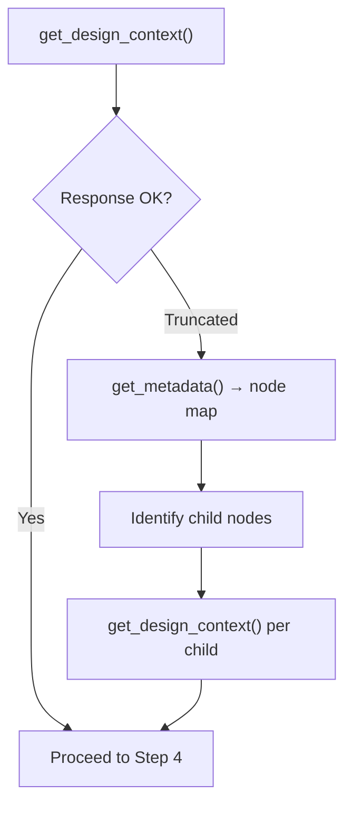
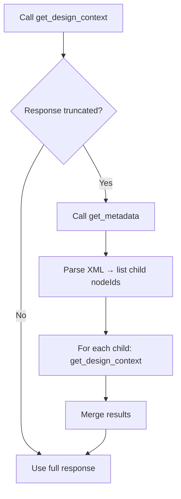
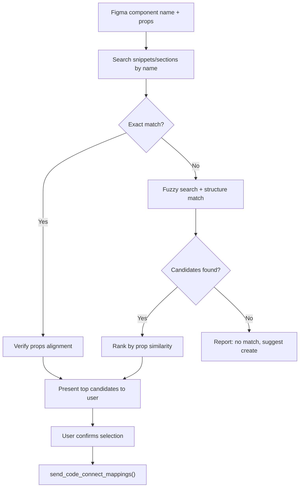
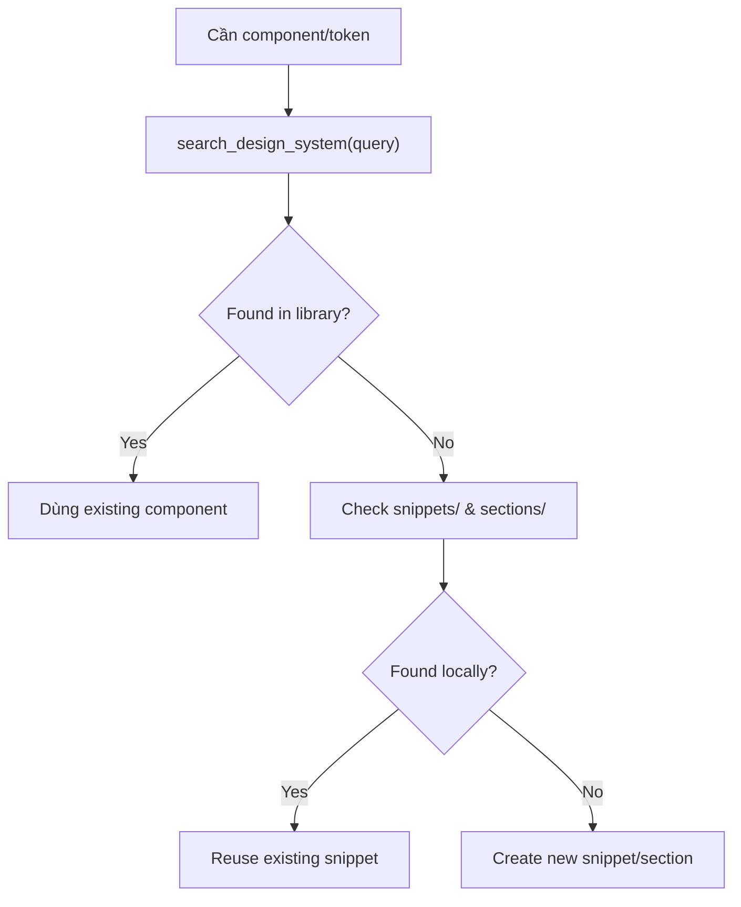
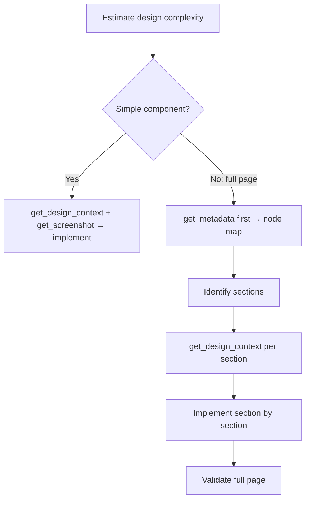
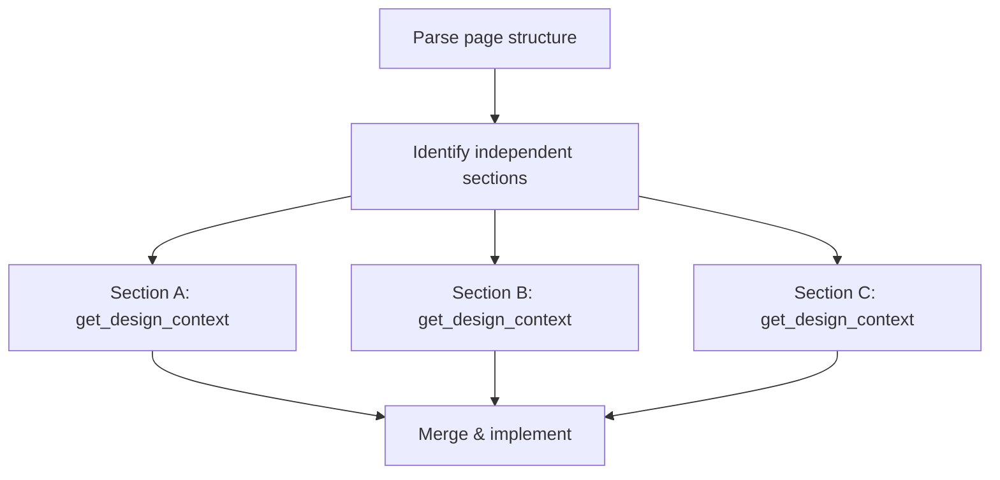
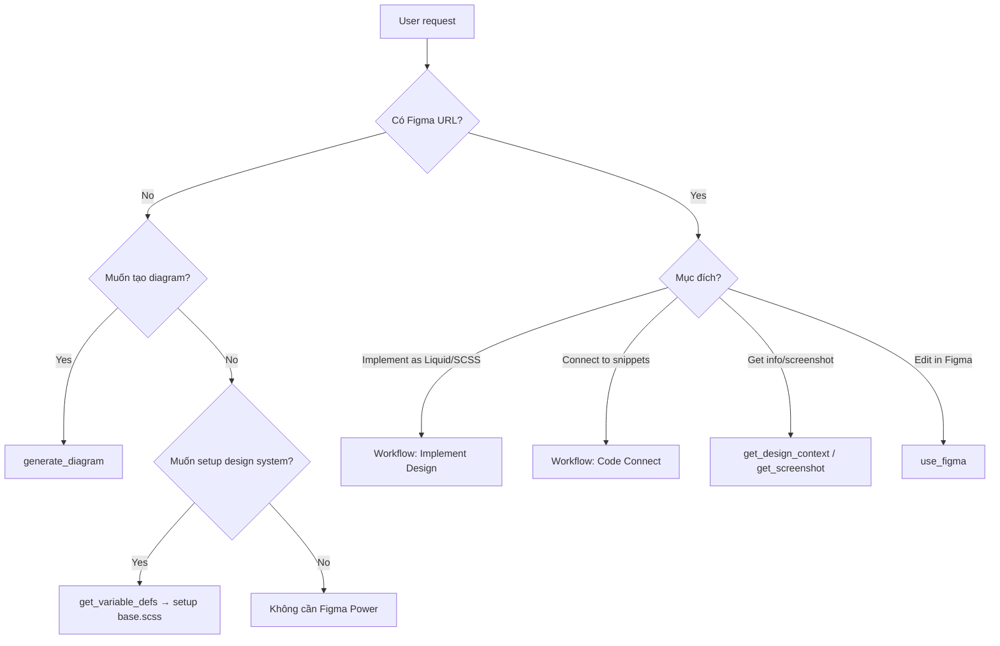

> Tổng quan Figma Power — phương pháp luận, cách tiếp cận, xử lý logic, và đề xuất tối ưu performance.
> Scope: Shopify Web Theme (Liquid + SCSS)

---

# Figma Power — Overview & Methodology

## 1. Kiến trúc tổng quan

Figma Power là integration layer kết nối IDE với Figma thông qua MCP (Model Context Protocol):



**Data flow:** Agent gọi MCP tools → MCP Server gọi Figma API → trả về structured data (JSON/XML/screenshot) → Agent xử lý → sinh Shopify Liquid + SCSS.

---

## 2. Ba workflow chính

### 2.1. Implement Design (Figma → Shopify Code)

**Mục tiêu:** Chuyển đổi Figma design thành Shopify Liquid sections/snippets + SCSS với pixel-perfect accuracy.

**Pipeline 7 bước:**

| Bước | Tên | Tool | Output |
|:----:|-----|------|--------|
| 0 | Setup tokens | `get_variable_defs` | `base.scss` với `$color-*`, `$space-*`, typography mixins |
| 1 | Parse URL | URL parsing | `fileKey`, `nodeId` |
| 2 | Fetch Design Context | `get_design_context` | Layout, typography, colors, spacing, component structure |
| 3 | Capture Visual Reference | `get_screenshot` | Visual reference image |
| 4 | Download Assets | Asset endpoint (localhost) | Images, icons, SVGs |
| 5 | Translate to Shopify | Code generation | Liquid + SCSS theo `design-system-rules.md` |
| 6 | Achieve Visual Parity | Refinement | Pixel-perfect adjustments (±2px spacing, ±1px font) |
| 7 | Validate | Comparison | Checklist: layout, typography, colors, states, responsive |

> Flow: **0 → 1 → 2 → 3 → 4 → 5 → 6 → 7** (sequential, không skip bước nào)

**Xử lý design phức tạp (truncated response):**



---

### 2.2. Code Connect (Design ↔ Code Mapping)

**Mục tiêu:** Tạo bidirectional link giữa Figma components và Shopify snippets/sections.

**Pipeline 4 bước:**

| Bước | Tên | Tool | Output |
|:----:|-----|------|--------|
| 1 | Get Suggestions | `get_code_connect_suggestions` | Danh sách unmapped components + props + thumbnails |
| 2 | Scan Codebase | Codebase search | Matched snippets/sections (by name, props, structure) |
| 3 | Present & Confirm | User interaction | User chọn mappings cần tạo |
| 4 | Save Mappings | `send_code_connect_mappings` | Batch save confirmed mappings |

> Flow: **1 → 2 → 3 → 4** (user confirm ở bước 3 trước khi save)

**Matching logic:**
1. So sánh tên component (exact → fuzzy)
2. So sánh props/variants (Figma properties ↔ snippet parameters)
3. So sánh hierarchy (nested structure)
4. Multiple candidates → rank theo prop-interface similarity → user quyết định

**Constraints:**
- Chỉ hoạt động với published components (team library)
- Yêu cầu Organization hoặc Enterprise plan
- Node ID phải convert format: URL dùng `-`, tool dùng `:`

---

### 2.3. Create Design System Rules (Convention Encoding)

**Mục tiêu:** Encode project conventions thành rules tự động áp dụng cho mọi Figma implementation task.

**Pipeline 4 bước:**

| Bước | Tên | Tool | Output |
|:----:|-----|------|--------|
| 1 | Fetch design variables | `get_variable_defs` | Colors, spacing, typography values |
| 2 | Analyze codebase | Codebase scan | Existing patterns: snippets, sections, SCSS structure |
| 3 | Generate rules | Agent logic | `base.scss` tokens + project-specific rules |
| 4 | Save & validate | File write + test | Rules saved → verify qua implement thử 1 component |

> Bước 4 có thể loop lại bước 3 để refine.

---

## 3. Phương pháp luận

### 3.1. Context-First Approach

Mọi workflow đều bắt đầu bằng thu thập context đầy đủ trước khi sinh code:

| Phase | Mục đích | Tools |
|-------|----------|-------|
| **Fetch** | Structured data từ Figma | `get_design_context`, `get_metadata` |
| **Visualize** | Visual reference làm source of truth | `get_screenshot` |
| **Materialize** | Download assets thực tế | Asset endpoint (localhost) |
| **Translate** | Chuyển đổi sang Liquid/SCSS conventions | Agent logic |
| **Validate** | So sánh output vs. Figma | Visual comparison |

### 3.2. Design Token Priority

Khi có conflict giữa Figma values và project tokens:

```
Project tokens ($color-*, $space-*, @mixin) > Figma raw values
```

Spacing/sizing được adjust để maintain visual fidelity. Không bao giờ hardcode — luôn map về token system.

### 3.3. Reuse Over Recreation

Trước khi tạo section/snippet mới:
1. Scan `sections/` và `snippets/` trong codebase
2. `search_design_system()` → tìm existing components trong library
3. Nếu tìm thấy → extend/compose thay vì duplicate
4. Chỉ tạo mới khi không có candidate nào phù hợp

### 3.4. Progressive Decomposition

Với design phức tạp, chia nhỏ theo Shopify structure:

```
Full Page
  └── Sections (sections/*.liquid)
        └── Blocks (blocks/*.liquid)
              └── Snippets (snippets/*.liquid)
```

Mỗi level fetch riêng qua `get_design_context` để tránh truncation.

---

## 4. Xử lý logic chi tiết

### 4.1. URL Parsing

```
Input:  https://figma.com/design/ABC123/MyFile?node-id=42-15
Output: fileKey = "ABC123", nodeId = "42:15"

Branch URL: https://figma.com/design/ABC123/branch/XYZ789/MyFile
Output: fileKey = "XYZ789" (dùng branchKey)
```

### 4.2. Truncation Handling



### 4.3. Component Matching (Code Connect)



### 4.4. Asset Resolution

```
Figma MCP response chứa asset URL
  → Nếu localhost URL → dùng trực tiếp (KHÔNG modify)
  → KHÔNG install icon packages mới
  → KHÔNG tạo placeholder
  → Download và store vào assets/
```

### 4.5. Design System Search Flow



---

## 5. Tool Inventory

| Tool | Category | Mục đích | Khi nào dùng |
|------|----------|----------|--------------|
| `get_design_context` | **Core** | Fetch structured design data | Mọi implementation task |
| `get_screenshot` | **Core** | Visual reference | Mọi implementation task |
| `get_metadata` | **Fallback** | Node structure overview (XML) | Khi design phức tạp/truncated |
| `get_variable_defs` | **Token** | Design variables & styles | Setup `base.scss` tokens |
| `search_design_system` | **Discovery** | Tìm components/variables/styles | Trước khi tạo component mới |
| `get_libraries` | **Discovery** | List design libraries | Khi cần biết available libraries |
| `get_code_connect_suggestions` | **Connect** | Detect unmapped components | Bắt đầu Code Connect workflow |
| `send_code_connect_mappings` | **Connect** | Save mappings (batch) | Sau khi user confirm |
| `add_code_connect_map` | **Connect** | Save single mapping | Mapping đơn lẻ |
| `get_code_connect_map` | **Connect** | Read existing mappings | Check trước khi map |
| `get_context_for_code_connect` | **Connect** | Component metadata | Tạo Code Connect template |
| `use_figma` | **Write** | Execute JS via Plugin API | Tạo/sửa design trong Figma |
| `generate_diagram` | **Write** | Mermaid → FigJam diagram | Tạo diagram |
| `create_new_file` | **Write** | Tạo Figma file mới | Cần file trống |
| `upload_assets` | **Write** | Upload images vào Figma | Push assets |
| `get_figjam` | **Read** | FigJam → XML | Đọc FigJam content |
| `whoami` | **Auth** | User info + plans | Verify auth, get planKey |

---

## 6. Đề xuất tối ưu performance

### 6.1. Giảm số lượng tool calls

| Thay vì | Nên |
|---------|-----|
| Gọi `get_design_context` cho từng child node | Gọi 1 lần cho parent, chỉ decompose khi truncated |
| Gọi `get_metadata` + `get_design_context` luôn | Gọi `get_design_context` trước, fallback `get_metadata` khi cần |
| Gọi `search_design_system` nhiều lần | Gọi 1 lần query broad, filter locally |
| Gọi `add_code_connect_map` từng cái | Dùng `send_code_connect_mappings` batch |

### 6.2. Context window management



- Component đơn lẻ (button, card, snippet): gọi trực tiếp `get_design_context`
- Section phức tạp: `get_metadata` trước → decompose → fetch từng phần
- Full page: luôn decompose

### 6.3. Parallel execution

Fetch `get_design_context` + `get_screenshot` cùng lúc (independent calls):



### 6.4. Caching strategy

| Data | Cache behavior |
|------|---------------|
| `get_design_context` response | Dùng lại trong session, không re-fetch |
| `get_screenshot` | Dùng lại trừ khi design thay đổi |
| `search_design_system` results | Dùng lại cho cùng fileKey trong session |
| `whoami` | Gọi 1 lần đầu session, cache planKey |
| `get_variable_defs` | Gọi 1 lần per file |

### 6.5. Design System Rules First

```
Không có rules:
  Mỗi task = explain conventions + fetch context + implement + fix
  → ~15-20 tool calls per component

Có rules (base.scss setup):
  Mỗi task = fetch context + implement
  → ~5-8 tool calls per component
  → Giảm ~60% tool calls
```

**Recommended order:**
1. `whoami` → verify auth
2. `get_variable_defs` → extract tokens
3. Setup `base.scss` với tokens
4. Bắt đầu implement sections/components

### 6.6. Tránh anti-patterns

| Anti-pattern | Hậu quả | Thay thế |
|-------------|---------|----------|
| Gọi `get_metadata` cho mọi request | Thừa 1 call cho simple components | Chỉ dùng khi truncated |
| Fetch toàn bộ page 1 lần | Truncation, context overflow | Decompose theo sections |
| Re-fetch screenshot sau mỗi code change | Waste calls | Fetch 1 lần, dùng lại |
| Tạo snippet mới không search trước | Duplicate | Check `snippets/` trước |
| Hardcode values thay vì dùng tokens | Inconsistency | `get_variable_defs` → `base.scss` |
| Gọi `whoami` nhiều lần | Redundant | Cache planKey từ lần đầu |

---

## 7. Decision Matrix



---

## 8. Limitations & Constraints

| Constraint | Impact | Mitigation |
|-----------|--------|------------|
| Code Connect chỉ cho Org/Enterprise plan | Không dùng được trên Starter/Pro | Manual mapping hoặc upgrade |
| Code Connect chỉ cho published components | Unpublished components không map được | Publish trước khi connect |
| `get_design_context` có thể truncate | Mất data cho complex designs | Decompose qua `get_metadata` |
| Assets served qua localhost | Chỉ accessible khi MCP server running | Không modify URLs |
| `use_figma` không support `setCurrentPage` | — | Luôn dùng `setCurrentPageAsync` |
| `use_figma` không support `getPluginData` | — | Dùng `getSharedPluginData` với namespace |
| Font style có space (e.g. "Semi Bold") | Không phải "SemiBold" | Chú ý khi set font style |
| Mermaid diagrams limited types | Không support class, timeline, venn | Dùng: flowchart, sequence, state, gantt, ER |

---

*Tài liệu cập nhật: 2026-05-20 | Scope: Shopify Web Theme (Liquid + SCSS)*
